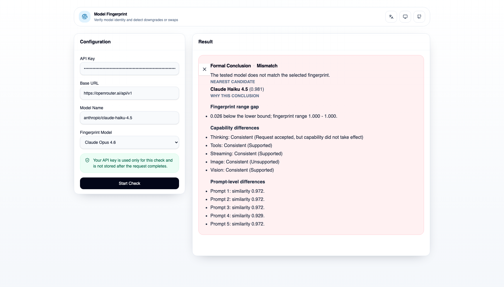

[English](./README.md) | 简体中文

# Model Fingerprint

验证模型身份，识别降智与替换。

[官方网站](https://model-fingerprint.com/) · [在线演示](https://model-fingerprint.com/) · [Web API 合同](./docs/apis/web_api_contract.md)

Model Fingerprint 是一个面向开发者的模型身份核验工具，用来判断某个被声明的 endpoint 是否真的匹配你选择的指纹模型。仓库内同时包含 Python engine、CLI 工作流、Next.js Web console，以及由同一套 engine 驱动的 `/api/v1` 路由。

## 为什么团队会用它

- 在生产流量切换前验证供应商的模型声明
- 识别降智、模型替换和供应商漂移
- 把托管 endpoint 与 pinned reference fingerprint 做比对
- 将协议兼容性与模型身份相似度分开判断

## 官方演示

官方演示站点在 [model-fingerprint.com](https://model-fingerprint.com/)。它对应的正是本仓库描述的在线检测流程：列出可选指纹模型、发起一次 live run、轮询进度、获取终态结果，以及在需要时取消一个正在执行的检测。

线上流程中的 API key 只用于当前这次检查，请求完成后不会被持久化保存。

## Case：Mismatch

下面这个 case 展示的是：将一个声明为 `anthropic/claude-haiku-4.5` 的 endpoint，用 `Claude Opus 4.6` 指纹进行检测。最终结果是正式 `mismatch`，同时把 `Claude Haiku 4.5` 识别为最近候选模型。



- 被测 endpoint：`anthropic/claude-haiku-4.5`，Base URL 为 `https://openrouter.ai/api/v1`
- 选择的指纹：`Claude Opus 4.6`
- 输出证据：指纹范围缺口、能力一致性，以及逐题 prompt similarity

## 仓库里有什么

- 用于 `run-suite`、`build-profile`、`calibrate`、`compare` 的 Python engine 与 CLI
- 位于 `apps/web` 的 Next.js Web console
- 位于 `apps/web/app/api/v1`、由 Python bridge 驱动的 Web API 路由
- 已纳入仓库的 calibration manifest、reference profile 和离线 quickstart fixtures

## 快速开始

### 直接体验在线演示

打开 [model-fingerprint.com](https://model-fingerprint.com/)，选择一个指纹模型，填入 OpenAI-compatible base URL，然后发起 live check。

### 本地运行 Web console

```bash
uv sync --extra dev
cd apps/web
pnpm install
pnpm dev
```

然后打开 `http://localhost:3000`。Next.js 应用会通过 `uv run python -m modelfingerprint.webapi.bridge_cli` 调用本地 Python bridge，因此本地 Web console 和仓库内 engine 使用的是同一份合同与执行路径。

### 运行离线 CLI 示例

对外公开的离线 fixtures 位于 `examples/quickstart/quick-check-v3/`。

```bash
uv sync --extra dev

RUN_DATE=2026-03-11
EXAMPLES=examples/quickstart/quick-check-v3

uv run python -m modelfingerprint.cli validate-prompts --root .
uv run python -m modelfingerprint.cli validate-endpoints --root .

uv run python -m modelfingerprint.cli run-suite quick-check-v3 \
  --root . \
  --target-label glm-5-a1 \
  --claimed-model glm-5 \
  --fixture-responses "$EXAMPLES/glm-5-a1.json" \
  --run-date "$RUN_DATE"
```

接下来可以继续使用同一批 fixtures 跑 `build-profile`、`calibrate` 和 `compare`，完整走通文件化 pipeline。

## 工作原理

1. 通过重复基线 run 构建稳定的 reference fingerprint。
2. 对 suspect endpoint 或离线 fixtures 执行某个已发布 suite。
3. 将 prompt、capability 和 protocol 证据与 pinned profile 做比较。
4. 在证据充足时输出正式结果，否则回退为 provisional 或 incompatible 状态。

模型身份证据与协议兼容性会被分开报告。

## 如何理解结果

- `formal_result`：证据充足，且协议路径兼容
- `provisional`：证据不完整，但足以提供调试参考
- `insufficient_evidence`：可用信号太少，无法可靠排序
- `incompatible_protocol`：协议层问题阻断了正常比较

Model Fingerprint 输出的是证据，不是数学意义上的身份证明。高 similarity 但 coverage 低时，结论需要谨慎解读。

## 仓库结构

- `examples/quickstart/quick-check-v3/`：公开 quickstart 使用的离线 fixtures
- `prompt-bank/`：prompt 定义与已发布 suites
- `endpoint-profiles/`：按 dialect 组织的 endpoint capability profiles
- `profiles/` 与 `calibration/`：已纳入仓库的 reference artifacts 与 manifests
- `src/modelfingerprint/`：CLI、contracts、services、transports、adapters 与 Web API bridge
- `apps/web/`：Web console、本地 API routes 与浏览器端交互
- `tests/`：contract、unit 与端到端测试

## 开发

```bash
uv sync --extra dev
uv run pytest -q
uv run ruff check src tests
uv run mypy src

cd apps/web
pnpm test
```

## 文档

- [Web API 合同](./docs/apis/web_api_contract.md)
